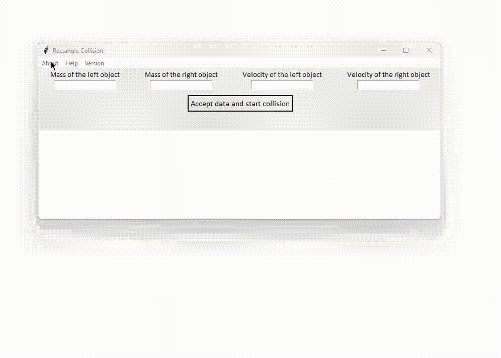

# tkinter rectangle-collision

[](https://github.com/GrimAveira/tkinter-rectangle-collision/actions)
[](https://github.com/GrimAveira/tkinter-rectangle-collision)
[](https://github.com/GrimAveira/tkinter-rectangle-collision/releases/tag/v0.0.3)

## Content

- [Preview](#preview)

- [How to install](#how-to-install-and-start)

- [Task 6](#task-6)

## Preview

A Python application with tkinter that allows you to look at the absolutely elastic collision of two rectangular bodies at a given mass and velocity



## How to install and start

```bash
$ git clone https://github.com/GrimAveira/tkinter-resize-inputed-text-app.

$ sudo apt install python3
(linux)

$ pip install tk

$ pip install pytest
# pytest for tests
$ python main.py
(or python3 on linux)

```

## Task 10

Требуется составить программу, которая выводила бы на экран cоударения двух прямоугольных тел с заданными скоростями и массой. 
Тела движутся вдоль оси x c заданными начальными скоростями. От вертикальных границ окна отражение идеально упругое.
